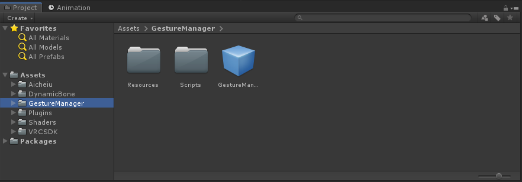

A tool that will help you preview and edit your avatar animation directly in Unity.

Available for both VRChat SDK 2.0 and SDK 3.0, in Unity 2018 or 2019.

## Branch Info

This Git Branch is mainly deprecated because VRChat moved to Unity 2019 almost 1 year ago.

But since people are still downloading and using the Gesture Manager 3.0 version because it's compatible
with Unity 2018 I've tough about updating it to a more stable and updated version.

There are currently no plans for updating further than Gesture Manager 3.4.

## How to Use (SDK 3.0)
### Download the right UnityPackage
For this branch there will probably be no official Git Releases. 
If you wish to use this version of my tool,
[please download it here](https://github.com/BlackStartx/VRC-Gesture-Manager/raw/Unity-2018/.releases/Gesture.Manager.3.2.(2018).unityPackage).

### Import on Unity
You can now import the UnityPackage directly in your project,
and you will find a folder called "GestureManager" in your **Assets** directory.

Drag and drop the prefab that you find in that folder in to the scene and you're done.

Whenever you want to test your avatar hit PlayMode and select the GestureManager from the Hierarchy!
 
If there are no errors the GestureManager will take control of your Avatar and you can start testing~ ♥

You can test Left and Right hand gesture with the buttons on top, and you can test 3.0 Expressions from
the RadialMenu bellow.

### Option Button!
The Option button in the RadialMenu contains a lot of sub-category that helps you change parameters that
usually are controlled by the VRChat client.

In the **Locomotion** category you can preview animation like:
- Walking
- Running
- Crouch
- Prone
- Falling

In the **States** category you can preview AFK and Seated animations.

In the **Tracking** category you can change the number of Tracking Point of your Avatar as well as the
VRMode parameter.

In the **Extra** category you can change Gesture Weights, MuteSelf, IsLocal and InStation parameters.

> If a button have a gray text it means that the parameter is not used by your avatar.

### Edit-Mode Feature
In the Option Menu you can find a button called: Edit-Mode. 
Clicking that button will enable the Edit-Mode feature and will create a clone of your avatar
giving him all the animation of your VRChat controller layers.

Since the avatar have all the animation you can edit them by going in to the Animation tab and selecting
your avatar from the hierarchy window.

The Default clip that opens will be the "Idle" animation clip. You can ignore it and select the animation
you want with the dropdown menu. 
From here, you can edit your animation as you usually do, by clicking the record button or by inserting keyframe manually.

### Knew Issues
There are some issue with the RadialMenu:
- Editing your 3.0 Avatar AnimatorControllers while your Avatar is controlled by the GestureManager could
  break the simulation and you need to restart the Play-Mode.

## How to Use (SDK 2.0)
### Download the right UnityPackage
If you're using the VRChat SDK 2.0 download the 2.0 UnityPackage from the release tab. 
[[Or click here to go to the 2.0 release](https://github.com/BlackStartx/VRC-Gesture-Manager/releases/tag/v2.0)]

> GestureManager 3.0 and newer releases are still compatible with VRChat SDK 2.0 but using the 2.0 release is recommended.

### Import on Unity

You can now import the UnityPackage directly in your project,
and you will find a folder called "GestureManager" in your **Assets** directory.

Drag and drop the prefab that you find in that folder in to the scene and you're done.

Whenever you want to test your avatar hit PlayMode and select the GestureManager from the Hierarchy!
 
If there are no errors the GestureManager will take control of your Avatar and you can start testing~ ♥

You can test Left and Right hand gestures by using the toggles in the Inspector window,
each gesture has the name of the animation file its related.

## Special Thanks~
Thanks to every friend and person who helped or supported me during the development of this tool~ ♥

- Stack_
- ♡ GaNyan ♡
- Nayu
- Ahri~
- Hiro N.
- [lindesu](https://github.vrlabs.dev/)

And special thanks to:

- You~ ♥

For any feedback fell free to contact me on Discord: BlackStartx#6593

Thanks again for using my script~ ♥  