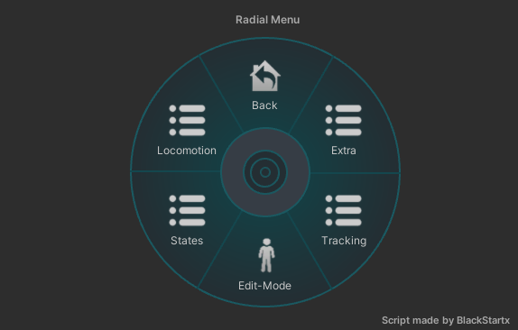

A tool that will help you preview and edit your avatar animation directly in Unity.

Available for both VRChat SDK 2.0 and SDK 3.0, in Unity 2018 or 2019.

## How To Use (SDK 3.0)
- ### Import using the VRChat Creator Companion

1) Open the VRChat Creator Companion app and select the project you want to add the package to.
    (If you have none, you may be interested on creating or adding a new project first)
     
2) On the right side you can select the packages you want to add to your project, be sure that
   you are not filtering out "Curated" packages!
     
3) Look for "Gesture Manager" and click the **Add** button!

 You have correctly imported the package into your project!
 Once the VCC app have finished doing the rest you're free to open the project and the tool 
will be there waiting for you~ ♥

- ### Import using the release UnityPackage
You can download the UnityPackage from the latest release tab. 
[[Or click here to go to the latest release](https://github.com/BlackStartx/VRC-Gesture-Manager/releases/latest)]

From there you can find the link for the UnityPackage at the bottom of the page, in the **Assets** tab. 

### Just one last step!
Once imported in your project, enable it by navigating to the Unity toolbar and click: 

`"Tools -> Gesture Manager Emulator"`

This will drop the **GestureManager** prefab into your scene! 

Whenever you want to test your avatar hit PlayMode and select the GestureManager from the Hierarchy!
 
If there are no errors the GestureManager will take control of your Avatar and you can start testing~ ♥

You can test Left and Right hand gesture with the buttons on top, and you can test 3.0 Expressions from
the RadialMenu bellow.

There are other features that can help you creating and testing your avatar easier.

Those feature are under the "Tools" tab.

# - Scene Camera

This tool will match the GameView camera with the SceneView camera.

Useful to move the camera around and test PhysBones and Contacts~

https://user-images.githubusercontent.com/26898122/224570606-125f3838-c97e-4379-afdf-42c989bad5cb.mp4

# - Clickable Contacts

This tool will trigger contact if clicked over with the mouse, similar to how PhysBones works.

You can also define a tag to filter the affected contacts!

https://user-images.githubusercontent.com/26898122/224572259-252527e0-b1ee-4121-8940-3e3ba618025a.mp4

The Option button in the RadialMenu contains a lot of sub-category that helps you change parameters usually 
controlled by the VRChat client.

In the **Locomotion** category you can preview animation like: 
- Walking 
- Running
- Crouch
- Prone
- Falling

In the **States** category you can preview AFK, Seated, IK and T Pose animations.

In the **Tracking** category you can change the number of Tracking Point of your Avatar as well as the 
VRMode parameter.

In the **Extra** category you can change Gesture Weights, MuteSelf, IsLocal and InStation parameters.

> If a button have a gray text it means that the parameter is not used by your avatar.

# - Edit Mode
In the Option Menu you can find a button called: Edit-Mode.

Clicking that button will enable the Edit-Mode feature and will create a clone of your avatar 
giving him all the animation of your VRChat controller layers.

Since the avatar have all the animation of your animators, you can edit them by going in to the Animation tab and selecting 
your avatar from the hierarchy window. (Or by clicking the blue "select your avatar" text under the RadialMenu)

Once there you can select the animation you want by clicking the dropdown menu.  
If you can't find it, look for the text `[Select Your Animation!]` and click it.

From here, you can edit your animation as you usually do, by clicking the record button or by inserting keyframe manually. 

The Debug tab of the Gesture Manager is where you can check lots of information about the current state of your avatar.

# Avatar Debug

This window contains: Animator Parameters, Tracking Controls, Animation Controllers Weight, Animator States and Layer 
Weights as well as Locomotion and Pose Space current values.

If you need to constantly check for updates of your avatar while using the Gesture Manager features you can undock the window by simply
clicking the `Undock Debug Window` button bellow.

This will create a floating window that you can move independently.
You can maximize it on another screen too, if you wish.

> The Debug Window is responsive, it will change the way content displayed inside of it depending of the width of the window.

#### Debug Window Example

# Osc Menu

In the Debug tab you can enable the integration for OSC data packages.

> The port you choose must be available for being listened to.
> 
> This mean that if VRChat is currently listening on those ports the simulation can't start. 

You can customize the port (and the address) directly from the OSC Debug Panel before starting the debug mode.

For a correct simulation of the behaviour of your Avatar trough Unity you should start the debugger on the same port
you use on your VRChat client, and load your custom settings from your LocalLow VRChat folder automatically with 
the button bellow.

If you don't load any custom setting the simulation will start listening on a wide-range of address.

This gif bellow shows the GestureManager receiving and processing data from the VRChat client itself. 
(It's simply achieved by inverting the listening/receiving ports)

#### Sending OSC messages

You can send custom packets as well using the "Send" tab while using the OSC Debug.

This can be useful to test how your application is handling OSC packets and for debugging purpose.

Simply set the OSC address string and populate the message parameters with the + button on the right. 
You can switch between OSC Messages and OSC bundles by clicking the "Bundle" or "Message" buttons.

### Knew Issues
♥ All the knew issues since the release of 3.0 has been addressed! ♥

## How To Use (SDK 2.0)
### Download the right UnityPackage
If you're using the VRChat SDK 2.0 download the 2.0 UnityPackage from the release tab. 
[[Or click here to go to the 2.0 release](https://github.com/BlackStartx/VRC-Gesture-Manager/releases/tag/v2.0)]

> GestureManager 3.0 and newer releases are still compatible with VRChat SDK 2.0 but using the 2.0 release is recommended.

### Import on Unity

You can now import the UnityPackage directly in your project,
and you will find a folder called "GestureManager" in your **Assets** directory.

Drag and drop the prefab that you find in that folder in to the scene and you're done.

Whenever you want to test your avatar hit PlayMode and select the GestureManager from the Hierarchy!
 
If there are no errors the GestureManager will take control of your Avatar and you can start testing~ ♥

You can test Left and Right hand gestures by using the toggles in the Inspector window, 
each gesture has the name of the animation file its related.

Thanks to every friend and person who helped or supported me during the development of this tool~ ♥

- Stack_
- Ahri~
- Nayu
- ♡ GaNyan ♡
- [BluWizard](https://github.com/BluWizard10)
- TheIceDragonz
- NinaV2
- [emymin](https://github.com/emymin/)
- Zettai Ryouiki
- NekOwneD
- [lindesu](https://github.vrlabs.dev/)
- OptoCloud
- lukasong
- .Rei.

Special thanks to:

- Hiro N.
- Dominhiho
- maple
- Feldarin
- [SashTheDee](https://twitter.com/SashTheDee)

And:

- You~ ♥

For any feedback fell free to contact me on Discord: blackstartx

Thanks again for using my script~ ♥  